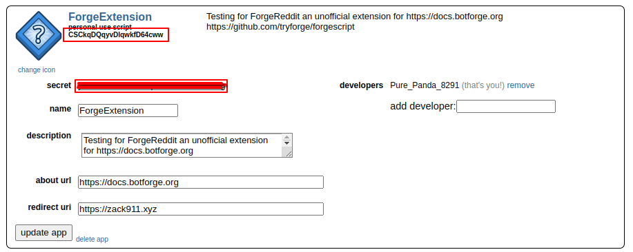

# ForgeSocial

Interact easily with all social platforms including **Reddit**, **Youtube (WIP)**, **X (WIP)** & **Twitch (WIP)*** easily all through one extension which handles all the boring stuff so you get to do the fun stuff!

# Getting The Reddit App Secrret & ID
Go to:
https://www.reddit.com/prefs/apps/
Create a new app with type **Script**

The clientID is the box highlighted using red but not filled the clientSecret is the box highlighted with red and filled
# Setup
```js
import { ForgeSocial } from "forgeSocial"

const reddit = new ForgeSocial({
  events: [
      "error"
  ],
  clientID: "",
  clientSecret: "",
  redditUsername: "",
})

const client = new ForgeClient({
  extensions: [
    reddit
  ],
  events: [
    'messageCreate'
  ],
  intents: [
    'Guilds',
    'GuildMessages',
    'MessageContent'
  ],
  prefixes: ['.']
})
```

Ps:
ForgeSocial will never support platforms like onlyfans or cornhub. If it makes you moan more than code I wont be adding that platform.